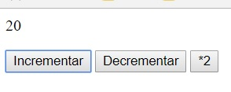
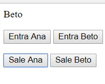
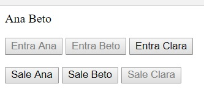

# Javascript y páginas Web - ejemplos y ejercicios

volver a [JavaScript](./javascript-intro.md)

<br/>

## Ejemplos
Están en la carpeta 
```
javascript-dom-basics
```
del [repositorio de ejemplos](https://github.com/obj2-material/javascript-dom).

En <span style="color: orange">`plain-js`</span> hay un archivo que define algunas funciones y las usa. 

En <span style="color: orange">`browser`</span> hay algunos ejemplos sencillos de definición de funciones y de modificación de una página usando el DOM. 
- en `simpleExample` la modificación se hace al cargarse la página.
- en `simpleExampleWithButton` y `simpleExampleDisappearingButton` se modifica el contenido y/o el estilo de un elemento, como respuesta al evento de pulsar un botón.
- en `cambiaColor` se alterna entre dos colores para un elemento.  
Se utiliza una variable para recordar cuál es el color actual.

<br/>

## Ejercicios

1.  
  Armar una página con un contador que muestre un valor y tres botones, que suman uno, restan uno, y multiplican por dos respectivamente, el valor que se muestra. Puede ser algo así  
      
  Consejos
  - Usar una variable para mantener el valor actual, ver cómo está hecho en el ejemplo `cambiaColor`.
  - Definir una función para cada botón.  
  - **<span style="color: blue">De lujo</span>**  
    Definir una función *aparte* que *solamente* actualice el valor del elemento. Las funciones de cada botón llaman a esta. Usar el `onLoad` que se puede poner en el `body` para mostrar el valor inicial.  
  <br/>
2.  
  Armar una página con un mensaje y botones que permitan cambiarle el tamaño de letra y el color. Puede ser algo así  
    
  Ver en los ejemplos cómo cambiar el color o el tamaño de un texto.  
  **<span style="color: blue">De lujo</span>**  
  Definir, en lugar de una función para cada botón, una sola que cambie tamaño y una sola que cambie color, pasando *como parámetro* el tamaño o el color que corresponde a cada botón.  
  <br/>
3. 
  Hay dos personas que pueden, o no, estar en un salón. Digamos Ana y Beto. Armar una página que muestre quiénes están, con un botón para registar la entrada y otro la salida, de cada persona. Suponiendo que de arranque Beto está y Ana no, podría ser algo así:  
    
  Si se pulsa el botón "Entra Ana", el texto de arriba cambia a "Ana Beto" (porque están los dos). Si después se pulsa el botón "Sale Beto", arriba cambia a "Ana" (porque quedó solamente Ana).  
  <br/>
4. 
  Ahora son tres personas que pueden, o no, estar. Digamos Ana, Beto y Clara. Ahora la página debería verse así: 
    
  **<span style="color: blue">De lujo</span>**  
  que solamente estén habilitados los botones que tienen sentido. Como se muestra en la imagen: al estar Ana y Beto, los botones habilitados son para que salga uno de ellos, y para que entre Clara.  
  Para esto, hay que manejar el atributo `disabled` de los botones, poniéndole un id a cada botón. Para p.ej. desabilitar el botón llamado `entraAnaButton`, se pone
  ```
  document.getElementById("entraAnaButton").disabled = true
  ```
  Obviamente, el `true` puede cambiarse por cualquier condición booleana, p.ej. una simple variable (guiño-guiño).

